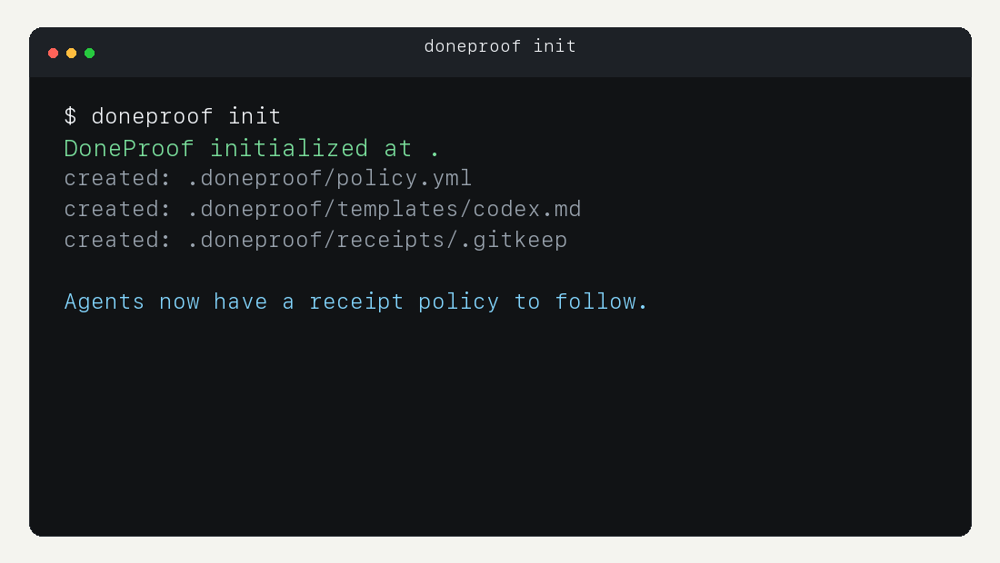

# DoneProof

No proof, no done.

[](https://github.com/giugiu-a11y/doneproof/actions/workflows/ci.yml)
[](https://github.com/giugiu-a11y/doneproof/actions/workflows/action-smoke.yml)
[](https://github.com/giugiu-a11y/doneproof/releases)
[](LICENSE)

DoneProof is a local verification layer for AI agent work. It makes agents produce a receipt before they claim work is ready.

It does not replace review. It makes review harder to fake.



## What You Get

- a small CLI for receipts, checks, reports, and git diff evidence;
- a composite GitHub Action for pull request gates;
- integration templates for Codex, Claude Code, Cursor, OpenCode, OpenClaw-style agents, and Hermes-style orchestrators;
- review language that blocks agents from claiming approval early.

See the visual walkthrough in [docs/DEMO.md](docs/DEMO.md).

## Why It Exists

DoneProof comes from real multi-agent work where the expensive failures were not model intelligence failures.

They were operations failures:

- an agent said work was ready without enough evidence;
- a handoff lost the actual state of the project;
- a later agent trusted a confident summary instead of checking files;
- a task was reported as finished while review still had to happen;
- the human had to discover missing tests, missing files, or unclear risk after the fact.

DoneProof turns those lessons into a small local rule: every agent delivery needs a receipt with files, commands, evidence, and risk.

## The Problem

AI agents are great at saying:

> Done.

But did the agent:

- change the files it claims it changed?
- run the command it claims it ran?
- preserve the evidence?
- mention the risks?
- avoid declaring victory before review?

DoneProof adds one rule:

> If there is no receipt, the work is not ready.

## Quick Start

Requires Python 3.10+.

Install from GitHub:

```bash
python3 -m pip install --upgrade pip
python3 -m pip install "doneproof @ git+https://github.com/giugiu-a11y/doneproof.git@v0.4.0"
```

Use it inside a repository:

```bash
doneproof init
doneproof new \
  --task "Add health check endpoint" \
  --changed-file README.md \
  --command "passed:python3 -m pytest" \
  --evidence "test:pytest passed" \
  --risk "Manual browser check not performed"
doneproof check
doneproof evidence git-diff
doneproof evidence git-diff --mode staged
doneproof report
doneproof report --format json
doneproof badge --format markdown
```

For local development on DoneProof itself:

```bash
git clone https://github.com/giugiu-a11y/doneproof.git
cd doneproof
python3 -m pip install --upgrade pip
python3 -m pip install -e ".[dev]"
make prepublish
```

## Demo

Animated walkthrough:


Full command transcript:

- [docs/DEMO.md](docs/DEMO.md)

Passing receipt:

```bash
doneproof check --receipt examples/receipts/passing.json
```

```text
DoneProof: PASS
```

Failing receipt:

```bash
doneproof check --receipt examples/receipts/failing.json
```

```text
DoneProof: FAIL
error: Forbidden status: done
error: changed_files needs at least 1 item(s)
error: commands needs at least 1 item(s)
error: evidence needs at least 1 item(s)
```

## Commands

```bash
doneproof init               # create policy and agent templates
doneproof new                # create a receipt draft
doneproof check              # validate a receipt
doneproof evidence git-diff  # write a sanitized git diff summary
doneproof evidence git-diff --mode staged
doneproof report             # print a human-readable receipt
doneproof report --format json
doneproof badge              # print a compact receipt badge
doneproof doctor             # check local setup
```

`check` and `report` default to:

```text
.doneproof/receipts/latest.json
```

`evidence git-diff` defaults to:

```text
.doneproof/evidence/git-diff-summary.txt
```

The git diff evidence helper stores file paths plus addition/deletion counts. It does not store full diff content by default. Reviewers should still inspect the actual diff before approval.

## Receipt Format

```json
{
  "task": "Add a health check endpoint",
  "status": "awaiting_review",
  "summary": "Added endpoint and tests.",
  "changed_files": ["app/main.py", "tests/test_health.py"],
  "commands": [
    {
      "cmd": "pytest tests/test_health.py",
      "status": "passed"
    }
  ],
  "evidence": [
    {
      "type": "test",
      "value": "pytest tests/test_health.py passed"
    }
  ],
  "risks": ["Manual browser check not performed"]
}
```

Machine-readable schema:

```text
schemas/receipt.schema.json
```

## Status Values

Allowed by default:

- `awaiting_review`
- `blocked`
- `failed`

Rejected by default:

- `done`
- `complete`
- `completed`
- `validated`
- `100%`
- `pronto`

DoneProof intentionally prefers review language. A human approves. The agent provides evidence.

## Agent Templates

After `doneproof init`, templates are created in:

```text
.doneproof/templates/
```

Included templates:

- `codex.md`
- `claude.md`
- `cursor.md`
- `opencode.md`
- `openclaw.md`
- `hermes.md`
- `aider.md`
- `cline.md`

Copy the relevant template into your agent instructions and adapt it to your repo.

Integration guides:

```text
docs/INTEGRATIONS.md
docs/integrations/
```

## GitHub Action

DoneProof includes a composite GitHub Action.

```yaml
- uses: giugiu-a11y/doneproof@v0.4.0
  with:
    receipt: .doneproof/receipts/latest.json
```

## PR Badge

Create a compact badge for pull request descriptions, CI comments, or handoff notes:

```bash
doneproof badge --format markdown
```

Example output:

```markdown

```

For automation, use structured output:

```bash
doneproof report --format json
doneproof badge --format json
```

Recommended pull request gate:

```yaml
name: DoneProof

on:
  pull_request:

jobs:
  receipt:
    runs-on: ubuntu-latest
    steps:
      - uses: actions/checkout@v6
      - uses: giugiu-a11y/doneproof@v0.4.0
        with:
          receipt: .doneproof/receipts/latest.json
```

## Agent Instruction

Paste this into `AGENTS.md`, `CLAUDE.md`, `.cursorrules`, or your agent instructions:

```text
Before final response, create or update .doneproof/receipts/latest.json.
Run doneproof check --receipt .doneproof/receipts/latest.json.
Use status awaiting_review for successful work. Do not say the work is approved.
Include changed files, commands, evidence, and residual risks.
```

More examples:

```text
docs/EXAMPLES.md
docs/EDITOR_TASKS.md
docs/POLICY_PRESETS.md
docs/integrations/
```

## Design Principles

- local-first;
- no telemetry;
- no cloud dependency;
- born from real agent-ops incidents;
- evidence over confidence;
- review status over completion claims;
- clear failure messages;
- safe examples only.

## When It Helps

DoneProof is useful when:

- more than one agent or chat can touch the same project;
- a human reviews agent work after the agent leaves;
- a repo has many small changes that are easy to overclaim;
- CI passing is not enough to prove the requested work was actually handled;
- the team wants agents to say `awaiting_review` instead of pretending approval already happened.

It is not a replacement for tests, CI, code review, product QA, or human approval. It is a lightweight pressure point that makes those steps easier to trust.

## Release Status

Current public release: `v0.4.0`.

The `main` branch is checked by CI and by an Action Smoke workflow that runs the composite action against the passing receipt fixture.
