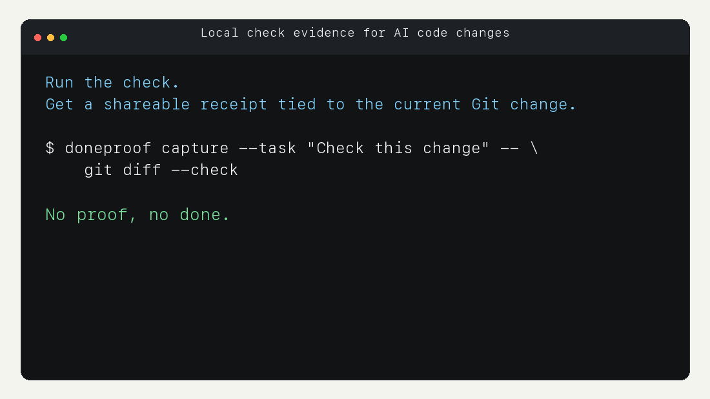

# DoneProof

When AI says “done,” ask for the receipt.

[](https://github.com/giugiu-a11y/doneproof/actions/workflows/ci.yml)
[](https://github.com/giugiu-a11y/doneproof/actions/workflows/action-smoke.yml)
[](https://github.com/giugiu-a11y/doneproof/actions/workflows/security.yml)
[](https://github.com/giugiu-a11y/doneproof/releases)
[](LICENSE)

DoneProof is a free, open-source tool for people who use AI to write code. Before the AI says the job is finished, DoneProof asks it to leave a simple receipt:

- what it changed;
- what checks it says it ran;
- what proof it saved;
- what still needs attention;
- whether a person has reviewed it.

It does not magically prove that the code is correct. It turns a vague “trust me, it’s done” into something you can actually inspect.



## Quick Start

Try it in 60 seconds.

Requires Python 3.10+.

```bash
python3 -m pip install "doneproof @ git+https://github.com/giugiu-a11y/doneproof.git@v0.5.0"
doneproof init
doneproof new \
  --task "Add health check endpoint" \
  --changed-file README.md \
  --command "passed:python3 -m pytest" \
  --evidence "test:pytest passed" \
  --risk "Manual browser check not performed"
doneproof check
doneproof report
```

A complete receipt can pass its checks while still being honest that a person has not reviewed the work:

```text
DoneProof: PASS
status: awaiting_review
```

Want to look before installing? Compare a [good receipt with a bad one](examples/receipts), then see the [step-by-step demo](docs/DEMO.md).

## What It Gives You

- a receipt you can read before trusting the result;
- a check that catches missing information;
- an optional GitHub Action for pull requests;
- ready-made instructions for Codex, Claude Code, Cursor, OpenCode, OpenClaw-style agents, and Hermes-style tools.

Choose an [agent integration](docs/INTEGRATIONS.md) or add the [GitHub Action](docs/GITHUB_ACTION.md) when you want the same receipt rule in pull requests.

## Why It Exists

I built DoneProof after seeing the same problem in real multi-agent work.

The worst problems were not always bad code. They were confident answers with weak proof:

- an agent said work was ready without enough evidence;
- important project details disappeared between conversations;
- another AI trusted a confident summary instead of checking the files;
- a task was reported as finished while review still had to happen;
- a person discovered missing tests, missing files, or hidden risks too late.

DoneProof turns those lessons into one small rule: every AI coding job needs a receipt.

> If there is no receipt, the work is not ready.

For local development on DoneProof itself:

```bash
git clone https://github.com/giugiu-a11y/doneproof.git
cd doneproof
python3 -m pip install --upgrade pip
python3 -m pip install -e ".[dev]"
make prepublish
```

## Demo

Animated walkthrough:


Full command transcript:

- [docs/DEMO.md](docs/DEMO.md)

Passing receipt:

```bash
doneproof check --receipt examples/receipts/passing.json
doneproof schema-check --receipt examples/receipts/passing.json
```

```text
DoneProof: PASS
```

Failing receipt:

```bash
doneproof check --receipt examples/receipts/failing.json
doneproof schema-check --receipt examples/receipts/failing.json
```

```text
DoneProof: FAIL
error: Forbidden status: done
error: changed_files needs at least 1 item(s)
error: commands needs at least 1 item(s)
error: evidence needs at least 1 item(s)
```

## Commands

```bash
doneproof init               # create policy and agent templates
doneproof new                # create a receipt draft
doneproof check              # validate a receipt
doneproof schema-check       # validate receipt JSON shape against schema
doneproof evidence git-diff  # write a sanitized git diff summary
doneproof evidence git-diff --mode staged
doneproof report             # print a human-readable receipt
doneproof report --format json
doneproof badge              # print a compact receipt badge
doneproof doctor             # check local setup
```

`check`, `schema-check`, and `report` default to:

```text
.doneproof/receipts/latest.json
```

`evidence git-diff` defaults to:

```text
.doneproof/evidence/git-diff-summary.txt
```

The git diff evidence helper stores file paths plus addition/deletion counts. It does not store full diff content by default. Reviewers should still inspect the actual diff before approval.

## Receipt Format

```json
{
  "task": "Add a health check endpoint",
  "status": "awaiting_review",
  "summary": "Added endpoint and tests.",
  "changed_files": ["app/main.py", "tests/test_health.py"],
  "commands": [
    {
      "cmd": "pytest tests/test_health.py",
      "status": "passed"
    }
  ],
  "evidence": [
    {
      "type": "test",
      "value": "pytest tests/test_health.py passed"
    }
  ],
  "risks": ["Manual browser check not performed"]
}
```

Machine-readable schema:

```text
schemas/receipt.schema.json
```

## Status Values

Allowed by default:

- `awaiting_review`
- `blocked`
- `failed`

Rejected by default:

- `done`
- `complete`
- `completed`
- `validated`
- `100%`
- `pronto`

DoneProof intentionally prefers review language. A human approves. The agent provides evidence.

## Agent Templates

After `doneproof init`, templates are created in:

```text
.doneproof/templates/
```

Included templates:

- `codex.md`
- `claude.md`
- `cursor.md`
- `opencode.md`
- `openclaw.md`
- `hermes.md`
- `aider.md`
- `cline.md`

Copy the relevant template into your agent instructions and adapt it to your repo.

Integration guides:

```text
docs/INTEGRATIONS.md
docs/integrations/
```

## GitHub Action

DoneProof includes a composite GitHub Action.

```yaml
- uses: giugiu-a11y/doneproof@89f2b9da284b770feeda94a75261ac42e145cdc9 # v0.5.0
  with:
    receipt: .doneproof/receipts/latest.json
```

## PR Badge

Create a compact badge for pull request descriptions, CI comments, or handoff notes:

```bash
doneproof badge --format markdown
```

Example output:

```markdown

```

For automation, use structured output:

```bash
doneproof report --format json
doneproof badge --format json
```

Recommended pull request gate:

```yaml
name: DoneProof

on:
  pull_request:

jobs:
  receipt:
    runs-on: ubuntu-latest
    steps:
      - uses: actions/checkout@9c091bb21b7c1c1d1991bb908d89e4e9dddfe3e0 # v7.0.0
      - uses: giugiu-a11y/doneproof@89f2b9da284b770feeda94a75261ac42e145cdc9 # v0.5.0
        with:
          receipt: .doneproof/receipts/latest.json
```

## Agent Instruction

Paste this into `AGENTS.md`, `CLAUDE.md`, `.cursorrules`, or your agent instructions:

```text
Before final response, create or update .doneproof/receipts/latest.json.
Run doneproof check --receipt .doneproof/receipts/latest.json.
Use status awaiting_review for successful work. Do not say the work is approved.
Include changed files, commands, evidence, and residual risks.
```

More examples:

```text
docs/EXAMPLES.md
docs/EDITOR_TASKS.md
docs/POLICY_PRESETS.md
docs/integrations/
```

## Design Principles

- local-first;
- no telemetry;
- no cloud dependency;
- born from real agent-ops incidents;
- evidence over confidence;
- review status over completion claims;
- clear failure messages;
- safe examples only.

## When It Helps

DoneProof is useful when:

- more than one agent or chat can touch the same project;
- a human reviews agent work after the agent leaves;
- a repo has many small changes that are easy to overclaim;
- CI passing is not enough to prove the requested work was actually handled;
- the team wants agents to say `awaiting_review` instead of pretending approval already happened.

It is not a replacement for tests, CI, code review, product QA, or human approval. It is a lightweight pressure point that makes those steps easier to trust.

## DoneProof System

DoneProof is the public evidence layer for AI coding-agent work. It can be combined with
private continuity and memory controls, but it does not depend on unpublished companion
projects and does not replace tests or human review.

## Release Status

Current public release: `v0.5.0`.

The `main` branch is checked by CI and by an Action Smoke workflow that runs the composite action against the passing receipt fixture.
